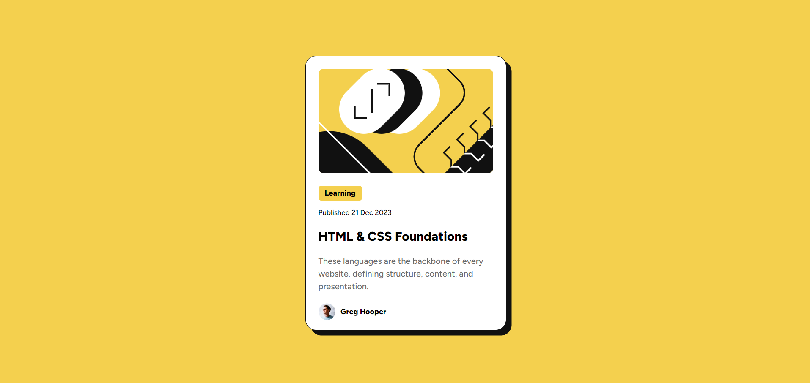

# Blog-Preview-Card
# Frontend Mentor - Blog Preview Card Solution

This is a solution to the [Blog preview card challenge on Frontend Mentor](https://www.frontendmentor.io/challenges/blog-preview-card-ckPaj01IcS). Frontend Mentor challenges help you improve your coding skills by building realistic projects. 

## Table of contents

- [Overview](#overview)
  - [The challenge](#the-challenge)
  - [Screenshot](#screenshot)
  - [Links](#links)
- [My process](#my-process)
  - [Built with](#built-with)
  - [What I learned](#what-i-learned)
  - [Continued development](#continued-development)
  - [Useful resources](#useful-resources)
- [Author](#author)
- [Acknowledgments](#acknowledgments)

## Overview

### The challenge

Users should be able to:

- See hover and focus states for all interactive elements on the page, such as the title, which changes color when hovered over.

### Screenshot




### Links

- Solution URL: [Add solution URL here](https://your-solution-url.com)
- Live Site URL: [Add live site URL here](https://your-live-site-url.com)

## My process

### Built with

- Semantic HTML5 markup
- Custom CSS properties for styling
- Flexbox for layout
- Mobile-first workflow
- Custom Fonts

### What I learned

While working on this project, I learned how to use custom properties (CSS variables) to make the design more maintainable. I also improved my skills in creating responsive designs with Flexbox and media queries.

Here’s an example of how I used variables for consistent theming:

```css
:root {
  --yellow: hsl(47, 88%, 63%);
  --black: #111;
  --gray: hsl(0, 0%, 42%);
  --font-family: 'Figtree', sans-serif;
}
```

### Continued development

I plan to improve the responsiveness of the card further, especially for smaller screens, and enhance the interactivity of elements like the title and author section. I’d also like to experiment with animations.

### Useful resources

- [Frontend Mentor](https://www.frontendmentor.io) - A great platform to practice coding challenges.
- [CSS Tricks](https://css-tricks.com/) - An excellent resource for Flexbox and responsive design tutorials.

## Author

- Frontend Mentor - [@Pavithra-Christy](https://www.frontendmentor.io/profile/Pavithra-Christy)


## Acknowledgments

Thanks to Frontend Mentor for the challenge, and for the inspiration from various other solutions I’ve seen. Special thanks to the community for feedback on my design.

 
